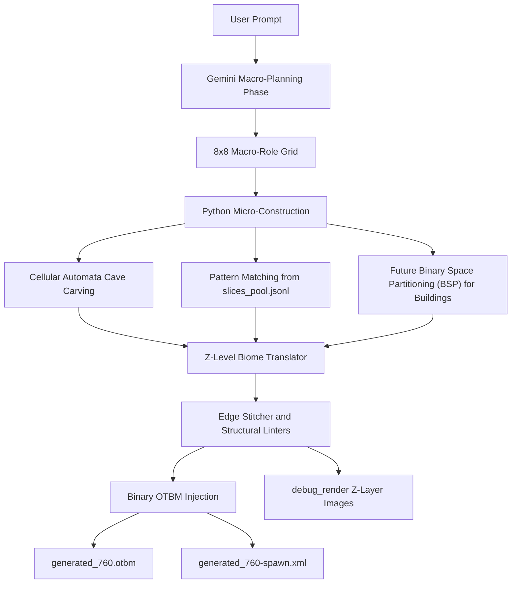
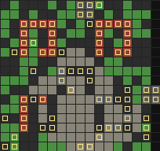
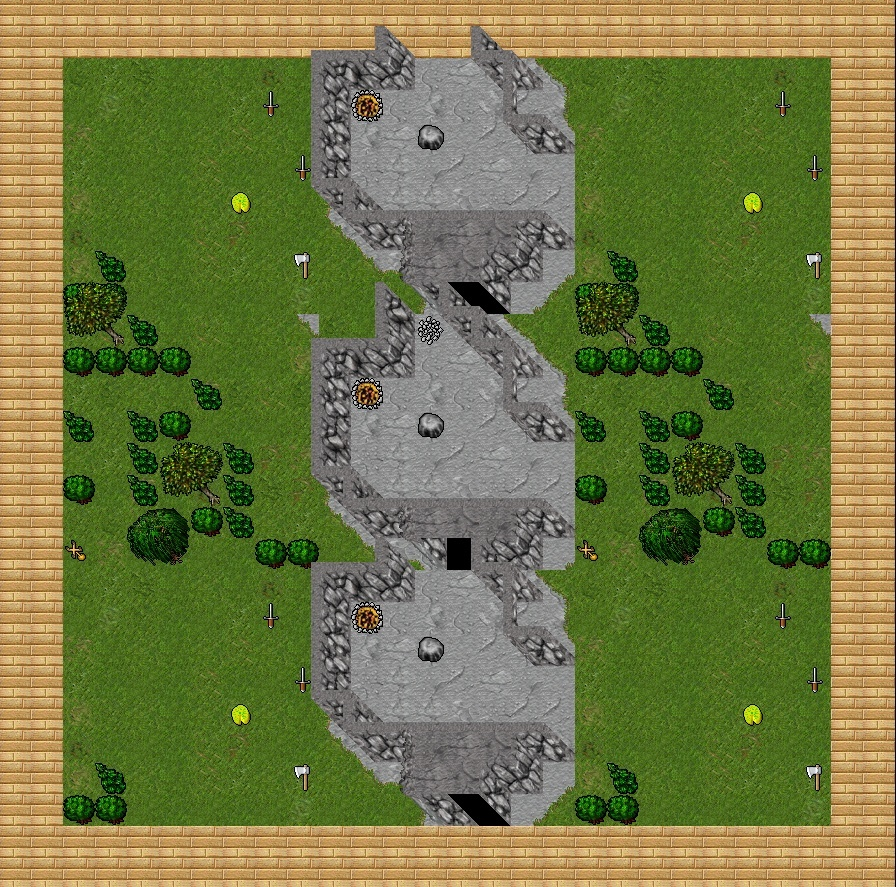
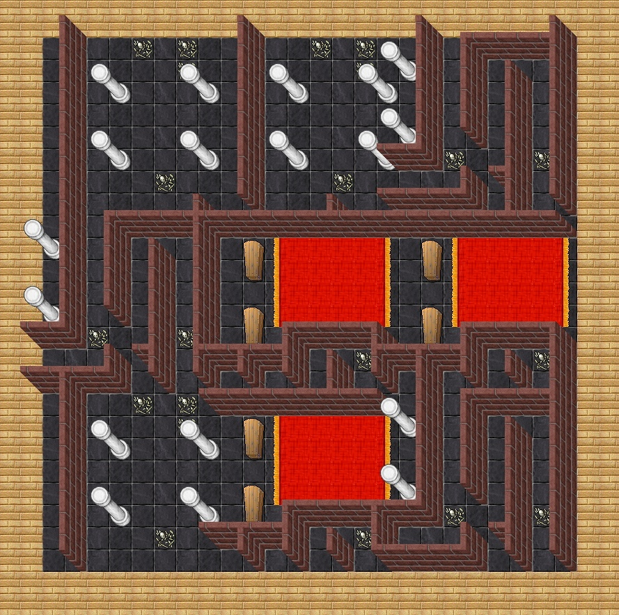

# RME AI - Hybrid 3D Map Generator for Tibia 7.60

## Disclaimer - Proof of Concept

RME AI is an experimental Proof of Concept (PoC). It is not a finished product,
not an official RME feature, and not affiliated with CipSoft or the Remere's Map
Editor project.

The goal of this repository is to explore a hybrid AI/procedural workflow for
OpenTibia mapping. The community is welcome to fork the project, open Issues,
submit Pull Requests, improve the procedural algorithms, add new biome rules,
and document compatibility findings.

## 1. Overview

RME AI is an experimental procedural map-generation toolkit for Remere's Map
Editor 3.7.0 and OpenTibia/Tibia 7.60 maps. It translates high-level natural
language prompts into OTBM-ready map edits by combining generative AI with
classic game-development algorithms.

The system is intentionally hybrid:

- Gemini performs high-level spatial planning.
- Python resolves deterministic geometry, asset IDs, and map validity.
- RME/Tibia 7.60 assets are read from `data/760/`.
- Real map fragments can be mined from large OTBM worlds and reused as style
  references.
- The final result is injected directly into an OTBM template compatible with
  RME.

The core design rule is simple: the AI plans intent, not sprites. Real item IDs,
wall orientation, chunk stitching, Z-level mutation, and binary serialization are
handled by Python.

### Compatibility Boundary

This project is tested and supported only for:

- Remere's Map Editor (RME) 3.7.0.
- Tibia 7.60 assets.
- The local `data/760/` XML configuration layout used by RME.
- OTBM templates saved from the same RME/Tibia 7.60 environment.

It may work with other RME versions, other client versions, or custom OpenTibia
distributions, but those targets are not officially supported. Different
`items.otb`, `items.xml`, `Tibia.dat`, `Tibia.spr`, wall rules, or doodad rules
can change IDs, collision behavior, sprite orientation, and OTBM expectations.

## 2. Hybrid Engine Architecture

### Phase 1 - Macro-Planning Phase

The FastAPI server (`ai_generator/server.py`) receives a user prompt and sends a
structured request to Google GenAI. Gemini returns a simplified macro-role grid,
where each cell represents an 8x8 chunk rather than individual tiles.

Current macro roles:

- `spawn_hub_dense`: dense spawn core, camp center, main room, or high-value
  structural area.
- `defensive_perimeter`: palisades, walls, rock edges, defensive terrain, or
  biome boundaries.
- `wild_surroundings`: natural corridors, forest, walkable cave space, and
  traversal filler.
- `camp_amenities`: beds, crates, campfires, supplies, chests, and roleplay
  details.

The server uses model failover to reduce quota friction:

```python
AVAILABLE_MODELS = ["gemini-2.5-flash", "gemini-2.0-flash", "gemini-1.5-flash"]
```

If a model returns `ResourceExhausted` or a rate-limit style error, the server
automatically retries with the next model in the list.

### Pipeline Flowchart



### Phase 2 - Cellular Automata Micro-Construction

Micro-geometry is resolved in `ai_generator/autotiler.py`. Gemini does not
choose raw Tibia IDs. Instead, Python materializes macro roles into valid Tibia
7.60 tiles through deterministic systems:

- 8x8 macro-chunk assembly.
- Pattern matching against `ai_generator/slices_pool.jsonl`.
- Semantic autotiling for walls, counters, lockers, tents, palisades, and props.
- Cellular Automata cave carving for organic cave corridors.
- Context-aware cave decoration that concentrates rubble, mud, and gravel near
  rock walls while keeping corridor centers clear for pathfinding.
- Composite-structure linting to avoid cutting multi-tile sprites at chunk
  borders.

For cave biomes such as `dirt_cave` and `ice_cave`, `wild_surroundings` chunks
can be carved with `generate_cellular_cave(...)` instead of being copied from a
flat slice. This produces smoother passages, more natural walls, and cleaner
chunk-to-chunk continuity.

The architecture is also prepared for Binary Space Partitioning (BSP). BSP is
the planned building-generation layer for depots, shops, houses, and other
urban structures where room subdivision, corridors, doors, and internal layout
must be deterministic.

### Understanding the Synthetic Debug Render

The engine can bake a lightweight visual matrix before writing final OTBM bytes.
This synthetic render is not meant to look like the Tibia client. It is a fast,
color-coded inspection layer used by humans and by the Visual Agentic Loop to
judge whether the map composition makes sense.



Color guide:

- Green tiles represent open traversal zone filler, such as forest grass, cave
  trails, or general walkable biome space.
- Red outlines map out walls, palisades, hard structural edges, and collision
  boundaries that shape the room or camp silhouette.
- Grey zones mark internal room flooring, stone surfaces, or specific floor
  layers produced by the Z-Level Biome Translator.
- Yellow square overlays point out dynamic decorations, containers, counters,
  props, and interactive spawn assets.

This render is what lets the Visual Agentic Loop validate spatial composition
with computer vision before the injector writes the final binary tile changes
into the OTBM file. In practice, it acts like a fast architectural X-ray of the
generated map.

### Phase 3 - Z-Level Biome Translator & Stitcher

The engine supports three-dimensional Z-layer injection. When a real slice has
`multilayer: true` and exposes `z_layers`, the autotiler can project adjacent
floors above and below the base layer while preserving the selected XY offset.

The Z-Level Biome Translator prevents visually invalid vertical inheritance:

- Upper layers of nature chunks can mutate into tent roofs, elevated wooden
  platforms, or tree canopy.
- Lower layers under surface nature do not inherit grass. They are translated
  into rustic underground floors, dirt-cave materials, or basement-like spaces.
- Static corpses and visually disruptive blockers are filtered from generic
  underground decoration.

The Edge Stitcher inspects shared chunk borders across the base plane and
adjacent Z planes. It smooths hard seams, connects corridor exits, and reduces
straight patch cuts between real slices and procedural geometry.

## 3. Requirements and Setup

Python 3.11 or newer is recommended.

Install dependencies from the project root:

```powershell
pip install -r requirements.txt
```

Expected dependencies:

- `fastapi`
- `uvicorn`
- `google-genai`
- `pydantic`
- `pillow`

Set your Gemini API key:

```powershell
$env:GEMINI_API_KEY = "YOUR_API_KEY"
```

The server reads the key only from `GEMINI_API_KEY`. Do not hardcode API keys in
source files, prompts, test scripts, screenshots, or shell history committed to
Git.

### Assets Setup - The Missing Link

The repository does not include copyrighted Tibia client assets, real world
maps, or large generated datasets. To run the engine locally, place your own
legally obtained files in the expected folders:

Required for RME/Tibia 7.60 asset compatibility:

- `data/760/Tibia.dat`
- `data/760/Tibia.spr`
- `data/760/items.xml`
- `data/760/materials.xml`
- `data/760/walls.xml`
- `data/760/doodads.xml`
- `data/760/grounds.xml`
- `data/760/borders.xml`
- `data/760/tilesets.xml`

Required for binary injection:

- `template/base_760.otbm`

Optional for targeted real-map mining:

- `template/real map/world.otbm`
- `world-spawn.xml` or `template/real map/world-spawn.xml`

These heavy or copyrighted files are intentionally ignored by `.gitignore`.
Users must provide them locally. Do not upload commercial Tibia assets, private
maps, mined slice pools, or generated binary map outputs to a public repository
unless you have the right to distribute them.

Important data files:

- `data/760/items.xml`: Tibia 7.60 item catalog and attributes.
- `data/760/walls.xml`: native RME wall rules.
- `data/760/doodads.xml`: native RME doodad compositions.
- `template/base_760.otbm`: base map template for injection.
- `template/real map/world.otbm`: optional real-world source map for mining.
- `world-spawn.xml`: optional ecological index for creature-driven slicing.

Large real maps and generated binary outputs should not be committed to a
public repository. See `.gitignore` for the protected paths.

## 4. Execution and Testing Guide

### Start the Local Server

Run from the project root:

```powershell
uvicorn ai_generator.server:app --reload --host 127.0.0.1 --port 8000
```

Main endpoint:

```text
POST http://127.0.0.1:8000/generate-map
```

### Test: Amazon Camp Venore

PowerShell example:

```powershell
$body = @{
    prompt = "Create a Tibia 7.60 Venore-style Amazon Camp with central canvas tents, defensive palisades, winding patrol paths, stacked supply crates, and Valkyrie resting bunks. It should feel like a classic CipSoft camp, not a square generic room."
    width = 16
    height = 16
} | ConvertTo-Json

Invoke-RestMethod `
    -Uri "http://127.0.0.1:8000/generate-map" `
    -Method Post `
    -ContentType "application/json" `
    -Body $body
```

The server flow:

1. Detects the requested biome, creature, or archetype from the prompt.
2. Selects real slices from `slices_pool.jsonl` when available.
3. Requests a macro-role grid from Gemini.
4. Materializes chunks with `autotiler.py`.
5. Generates debug renders for visual inspection.
6. Optionally runs a multimodal visual feedback phase when references exist.
7. Injects the final tiles into the OTBM template.
8. Generates a companion spawn XML when targeted slice metadata is available.

## 5. Output Structure

Primary outputs are written to `template/`:

- `template/generated_760.otbm`: final injected map.
- `template/generated_760-spawn.xml`: RME-compatible generated spawn file.
- `template/debug_render.png`: synthetic debug render for the base layer.
- `template/debug_render_p0.png`, `template/debug_render_p1.png`, etc.:
  auxiliary Z-layer renders for vertical inspection.

Generated tool data:

- `ai_generator/tibia_760_catalog.json`: compact Tibia 7.60 item catalog.
- `ai_generator/archetypes.json`: curated archetypes extracted from real maps.
- `ai_generator/slices_pool.jsonl`: incremental pool of real map fragments.

These generated datasets can become large and may contain data derived from
private or copyrighted maps. They are ignored by default and should be
regenerated locally when needed.

## 6. Visual Examples & Prompt Gallery

Use this section to link screenshots from `docs/gallery/` and keep the exact
prompts that produced each result.

### Monsters Camp Surface

Image:



Prompt:

```powershell
$body = @{
    prompt = "Create a Tibia 7.60 Venore-style Amazon Camp with central canvas tents, defensive palisades, winding patrol paths, stacked supply crates, and Valkyrie resting bunks. It should feel like a classic CipSoft camp, not a square generic room."
    width = 16
    height = 16
} | ConvertTo-Json
```

### Underground Cave System (-1)

Image:



Prompt:

```powershell
$body = @{
    prompt = "a deep ice cave infested with frost trolls with a stone ramp descending into a frozen basement layout"
    width = 24
    height = 24
} | ConvertTo-Json
```

### Thais Depot Architecture

Reference image placeholder:

```text
ai_generator/references/thais_depot.png
```

Prompt:

```powershell
$body = @{
    prompt = "Create a classic Tibia 7.60 Thais-style depot with stone flooring, north and east locker layout, counters, mailbox area, and clean pedestrian lanes."
    width = 16
    height = 16
} | ConvertTo-Json
```

## Main Modules

- `ai_generator/server.py`: FastAPI entrypoint, prompts, model failover, slice
  selection, visual feedback loop, spawn XML output, and final injection.
- `ai_generator/autotiler.py`: semantic materialization engine, macro chunks,
  Cellular Automata cave carving, Z-level rules, stitcher, and future BSP
  integration point.
- `ai_generator/injector.py`: binary OTBM writer with node traversal and byte
  escaping support.
- `ai_generator/map_slicer.py`: sequential and targeted mining of real map
  slices, including collision metadata and multilayer Z capture.
- `ai_generator/extractor.py`: curated point archetype extraction.
- `ai_generator/rme_parser.py`: parser for native RME rules from `walls.xml` and
  `doodads.xml`.
- `ai_generator/map_renderer.py`: synthetic PNG renderer for visual debugging.

## Design Philosophy

The AI defines spatial intent. The engine resolves implementation. This
separation reduces ID hallucinations, keeps Tibia 7.60 compatibility high, and
lets classic procedural algorithms do what they are best at: geometry,
connectivity, constraints, and deterministic cleanup.

## Community Credits

Thanks to the OpenTibia mapping and tooling community for years of reverse
engineering, documentation, and editor knowledge.

Special thanks to OpenTibia.info and Tibiantis.info for publicly available
graphical documentation and map-library imagery that helped shape the visual
research direction of this PoC. Those references are used as design inspiration
and visual study material; the repository does not redistribute copyrighted
client assets or proprietary map files.
