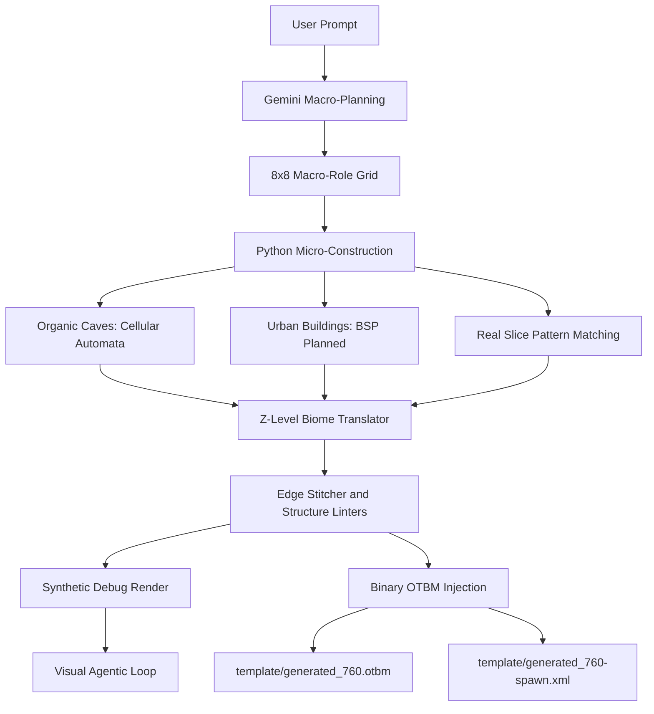
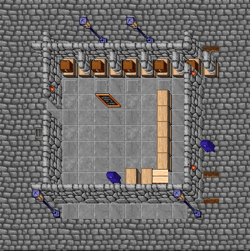

# RME AI

## Hybrid 3D Procedural Map Generator for RME 3.7.0 and Tibia 7.60

RME AI is an experimental open-source toolkit that turns high-level map prompts
into Remere's Map Editor compatible `.otbm` output. It blends AI planning,
classic procedural generation, real Tibia 7.60 assets, and binary OTBM injection
into one practical workflow for OpenTibia mapping research.

> [!WARNING]
> **Proof of Concept.** RME AI is an experimental PoC, not an official RME
> feature and not affiliated with CipSoft or the Remere's Map Editor project.
> Forks, Issues, Pull Requests, algorithm experiments, compatibility reports,
> and new biome rules are welcome.

---

## What This Project Does

RME AI does not ask the language model to guess item IDs. Instead, the AI plans
spatial intent while Python resolves the hard technical work:

- It asks Gemini for an 8x8 macro-chunk layout.
- It mines real map fragments from large OTBM worlds when available.
- It carves organic cave corridors with Cellular Automata.
- It prepares a future Binary Space Partitioning path for deterministic
  buildings.
- It stitches borders, translates Z-level biomes, and filters unsafe props.
- It writes the final generated data directly into an OTBM template.

> [!NOTE]
> **Design Philosophy.** The AI defines *intent*. The engine resolves
> *implementation*. This keeps Tibia 7.60 compatibility high and prevents the
> model from hallucinating fragile sprite IDs.

---

## Compatibility Boundary

This repository is tested and supported only for:

- **Remere's Map Editor:** 3.7.0
- **Client assets:** Tibia 7.60
- **Configuration layout:** local `data/760/` RME XML files
- **Map template:** `.otbm` files saved from the same RME/Tibia 7.60 setup

It may work with other RME builds, custom OpenTibia distributions, or later
client versions, but those targets are not officially supported. Different
`items.otb`, `items.xml`, `Tibia.dat`, `Tibia.spr`, wall rules, doodads, or OTBM
expectations can change IDs, collision behavior, and sprite orientation.

---

## Hybrid Pipeline



---

## Phase 1 - Macro-Planning With Gemini

The FastAPI server (`ai_generator/server.py`) receives a user prompt and asks
Gemini for a simplified macro-role grid. Each returned tile is not a real Tibia
tile; it is a high-level 8x8 chunk instruction.

Current macro roles:

| Macro role | Meaning |
| --- | --- |
| `spawn_hub_dense` | Dense camp core, main room, creature hub, or high-value structure. |
| `defensive_perimeter` | Palisades, walls, rock edges, hard boundaries, or defensive terrain. |
| `wild_surroundings` | Forest, walkable cave corridors, natural filler, trails, and biome transitions. |
| `camp_amenities` | Crates, bunks, campfires, supply corners, counters, and roleplay props. |

Model failover is built in:

```python
AVAILABLE_MODELS = ["gemini-2.5-flash", "gemini-2.0-flash", "gemini-1.5-flash"]
```

If a model hits quota or rate limits, the server automatically tries the next
model in the list.

---

## Phase 2 - Micro-Construction Engines

Micro-construction happens in Python, not in the LLM. The semantic macro-grid is
materialized by `ai_generator/autotiler.py`, which chooses real Tibia 7.60 IDs
from RME rules, mined slices, and deterministic procedural algorithms.

| Engine | Status | What it does |
| --- | --- | --- |
| **[Map] Organic Caves Engine (Cellular Automata)** | Active | Sculpted cave masks start as noisy wall/floor grids, then smooth into natural corridors. The engine opens connector gates between chunks, places rock walls along the mask, and concentrates gravel, mud, and small rubble near wall edges so path centers stay readable. |
| **[Building] Urban Architecture Engine (BSP - Planned)** | Planned | Binary Space Partitioning will split macro-chunks into mathematically clean rooms, corridors, and service zones. The goal is to build depots, shops, houses, and temples with deterministic symmetry instead of free-form model guessing. |
| **Real Slice Pattern Matcher** | Active | When real map fragments exist in `slices_pool.jsonl`, the engine can stamp compact CipSoft-like fragments directly into generated areas while preserving native prop rhythm. |
| **Composite Structure Linter** | Active | Multi-tile sprites such as rocks, tents, counters, and camp structures are expanded near borders to prevent cut-off sprites and floating halves. |

---

### Understanding the Synthetic Debug Render

Before writing final binary OTBM bytes, the engine can bake a tiny visual matrix
called `debug_render.png`. This is not a Tibia screenshot. It is a color-coded
architectural X-ray of the generated map.


**Green tiles**
: Open traversal zone filler, such as forest grass, cave trails, organic ground,
  or general walkable biome space.

**Red outlines**
: Walls, palisades, rock boundaries, hard collision edges, and structural shapes
  that define the silhouette of a camp, cave, or building.

**Grey zones**
: Internal room floors, stone surfaces, depot-like flooring, or Z-layer-specific
  floor materials.

**Yellow square overlays**
: Dynamic decorations, containers, counters, spawn-related props, and
  interactive assets copied from real slices or placed by the autotiler.

This render is the visual checkpoint used by the **Visual Agentic Loop**. Gemini
can compare it against a real reference image, reason about composition, and
rewrite the macro-role grid before the injector commits irreversible binary
changes to the OTBM template.

---

## Phase 3 - Z-Level Biome Translator and Edge Stitcher

RME AI supports multi-floor injection. If a mined slice contains `z_layers`, the
autotiler can project roofs, upper platforms, basements, or lower cave floors
while preserving the same XY alignment.

The Z-Level Biome Translator prevents bad vertical inheritance:

- Surface grass does not blindly appear in basements.
- Amazon Camp upper layers can mutate into tent roofs, canopy, or wood-like
  structures.
- Lower layers can become rustic underground floors or dirt-cave systems.
- Static corpses and disruptive blockers are filtered from generic underground
  decoration.

The Edge Stitcher then smooths chunk boundaries so roads, caves, palisades, and
multi-floor details do not look like square pasted patches.

---

## Requirements and Setup

Python 3.11 or newer is recommended.

```powershell
pip install -r requirements.txt
```

Expected dependencies:

- `fastapi`
- `uvicorn`
- `google-genai`
- `pydantic`
- `pillow`

Set your Gemini API key:

```powershell
$env:GEMINI_API_KEY = "YOUR_API_KEY"
```

The server reads the key only from `GEMINI_API_KEY`. Never hardcode API keys in
source files, prompts, screenshots, or committed shell scripts.

> [!IMPORTANT]
> **Assets Setup - The Missing Link**
>
> This repository does not ship copyrighted Tibia client files, private maps, or
> large mined datasets. To run the engine locally, you must provide your own
> legally obtained assets:
>
> - `data/760/Tibia.dat`
> - `data/760/Tibia.spr`
> - `data/760/items.xml`
> - `data/760/materials.xml`
> - `data/760/walls.xml`
> - `data/760/doodads.xml`
> - `template/base_760.otbm`
>
> For targeted real-map mining, also provide:
>
> - `template/real map/world.otbm`
> - `world-spawn.xml` or `template/real map/world-spawn.xml`
>
> Heavy assets, mined pools, real maps, generated OTBM files, and private visual
> references are intentionally ignored by `.gitignore`.

---

## Running the API

Start the local server:

```powershell
uvicorn ai_generator.server:app --reload --host 127.0.0.1 --port 8000
```

Endpoint:

```text
POST http://127.0.0.1:8000/generate-map
```

The main output files are written to `template/`:

| File | Purpose |
| --- | --- |
| `template/generated_760.otbm` | Final injected map. |
| `template/generated_760-spawn.xml` | Optional generated spawn file. |
| `template/debug_render.png` | Base synthetic render. |
| `template/debug_render_p0.png`, `template/debug_render_p1.png` | Optional Z-layer inspection renders. |

---

## 6. Visual Examples and Prompt Gallery

### Example 1: Monsters Camp Surface


```powershell
$body = @{
    prompt = "Create a Tibia 7.60 Venore-style Amazon Camp with central canvas tents, defensive palisades, winding patrol paths, stacked supply crates, and Valkyrie resting bunks. It should feel like a classic CipSoft camp, not a square generic room."
    width = 16
    height = 16
} | ConvertTo-Json

Invoke-RestMethod `
    -Uri "http://127.0.0.1:8000/generate-map" `
    -Method Post `
    -ContentType "application/json" `
    -Body $body
```

---

### Example 2: Underground Cave System (Floor -1)


```powershell
$body = @{
    prompt = "a deep ice cave infested with frost trolls with a stone ramp descending into a frozen basement layout"
    width = 24
    height = 24
} | ConvertTo-Json

Invoke-RestMethod `
    -Uri "http://127.0.0.1:8000/generate-map" `
    -Method Post `
    -ContentType "application/json" `
    -Body $body
```

---

### Example 3: Thais Depot Architecture



```powershell
$body = @{
    prompt = "Create a classic Tibia 7.60 Thais-style depot with stone flooring, north and east locker layout, counters, mailbox area, and clean pedestrian lanes."
    width = 16
    height = 16
} | ConvertTo-Json

Invoke-RestMethod `
    -Uri "http://127.0.0.1:8000/generate-map" `
    -Method Post `
    -ContentType "application/json" `
    -Body $body
```

---

## Main Modules

| Module | Role |
| --- | --- |
| `ai_generator/server.py` | FastAPI entrypoint, Gemini prompts, model failover, visual feedback loop, and final orchestration. |
| `ai_generator/autotiler.py` | Semantic materialization, macro chunks, Cellular Automata caves, Z-level rules, edge stitching, and BSP integration point. |
| `ai_generator/injector.py` | Binary OTBM writer with node traversal and byte escaping. |
| `ai_generator/map_slicer.py` | Sequential and targeted mining of real map slices with collision metadata and Z-layer capture. |
| `ai_generator/extractor.py` | Curated point archetype extraction. |
| `ai_generator/rme_parser.py` | Parser for native RME rules from `walls.xml` and `doodads.xml`. |
| `ai_generator/map_renderer.py` | Synthetic PNG renderer for visual debugging. |

---

## Community Credits

Thanks to the OpenTibia mapping and tooling community for years of reverse
engineering, documentation, and editor knowledge.

Special thanks to OpenTibia.info and Tibiantis.info for publicly available
graphical documentation and map-library imagery that helped shape the visual
research direction of this PoC. Those references are used as design inspiration
and visual study material; this repository does not redistribute copyrighted
client assets or proprietary map files.
